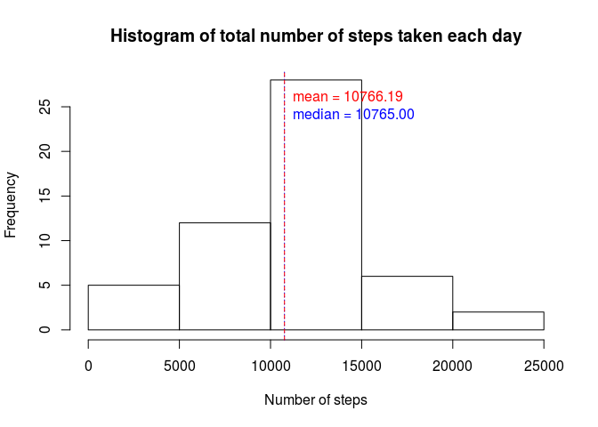
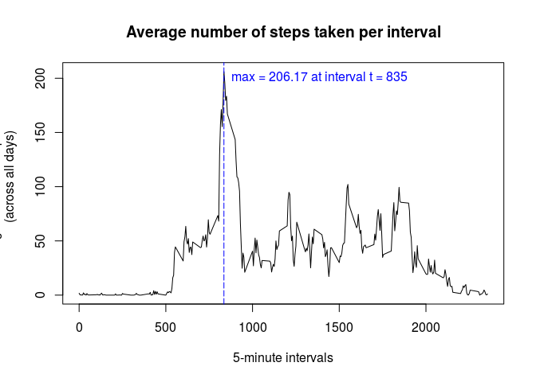
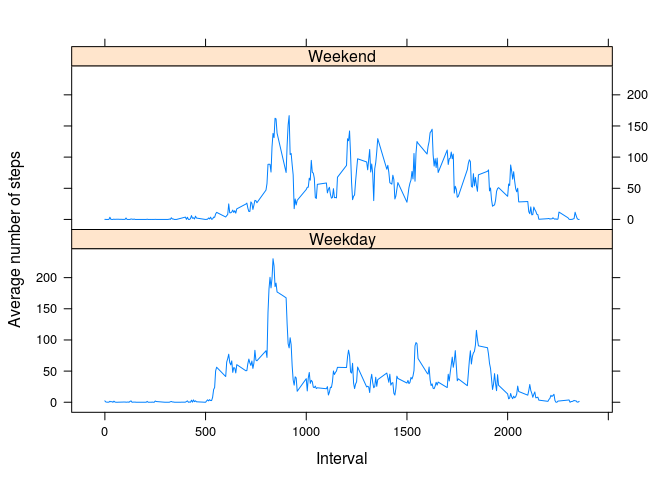

# Reproducible Research: Peer Assessment 1

## Loading and preprocessing the data


```r
activity <- read.csv(unz("activity.zip", "activity.csv"))
head(activity)
```

```
##   steps       date interval
## 1    NA 2012-10-01        0
## 2    NA 2012-10-01        5
## 3    NA 2012-10-01       10
## 4    NA 2012-10-01       15
## 5    NA 2012-10-01       20
## 6    NA 2012-10-01       25
```
The column data is loaded as a factor variable and needs to be converted date variable.


```r
activity$date <- as.Date(activity$date, "%Y-%m-%d")
class(activity$date)
```

```
## [1] "Date"
```
The variables _steps_ and _interval_ are both appropriately loaded as integers.

## What is mean total number of steps taken per day?


```r
totalStepsByDay <- aggregate(steps ~ date, data = activity, FUN = sum, na.rm = TRUE)
head(totalStepsByDay)
```

```
##         date steps
## 1 2012-10-02   126
## 2 2012-10-03 11352
## 3 2012-10-04 12116
## 4 2012-10-05 13294
## 5 2012-10-06 15420
## 6 2012-10-07 11015
```

Note that the first day, 2012-10-01, in the original dataset has no recorded values for the number of steps. This day, and many others like it, is excluded from the new dataset *totalStepsByDay*.


```r
hist(totalStepsByDay$steps, main = "Histogram of total number of steps taken each day", xlab = "Number of steps")

meanStepsByDay <- mean(totalStepsByDay$steps)
medianStepsByDay <- median(totalStepsByDay$steps)
meanstr <- sprintf("mean = %.2f", meanStepsByDay)
medianstr <- sprintf("median = %.2f", medianStepsByDay)

abline(v = medianStepsByDay, lty = 3, col = "blue")
abline(v = meanStepsByDay, lty = 2, col = "red")
text(meanStepsByDay,26,labels=meanstr, pos=4, col="red")    
text(medianStepsByDay,24,labels=medianstr, pos=4, col="blue") 
```

\
As one can see the mean and median are practically indistinguishable on the history


```r
meanStepsByDay
```

```
## [1] 10766.19
```

```r
medianStepsByDay
```

```
## [1] 10765
```

## What is the average daily activity pattern?

Create a new dataset from the old *activity*  that records the average number
of steps for each given interval across all days.


```r
avgStepsByInterval <- aggregate(steps ~ interval, data = activity, mean)
head(avgStepsByInterval)
```

```
##   interval     steps
## 1        0 1.7169811
## 2        5 0.3396226
## 3       10 0.1320755
## 4       15 0.1509434
## 5       20 0.0754717
## 6       25 2.0943396
```

A time-series plot of the 5-minute interval (x-axis) and the average number of 
steps taken (y-axis) taken from new dataset. Find and mark the 


```r
with(avgStepsByInterval, 
    plot(interval, steps, type = "l", 
    xlab = "5-minute intervals", ylab = "average number of steps taken 
    (across all days)", main = "Average number of steps taken per interval"))
    
maxInterval <- 
    avgStepsByInterval[which.max(avgStepsByInterval$steps),]$interval

abline(v = maxInterval,lty = 5, col = "blue")
maxstr <- sprintf("max = %.2f at interval t = %i", max(avgStepsByInterval$steps), maxInterval)
text(maxInterval, 200, labels = maxstr, pos=4, col="blue")
```

\

As seen from the time-series plot, the 5-minute interval with the greatest
number of steps is


```r
maxInterval
```

```
## [1] 835
```

## Imputing missing values

The number of missing values in the dataset is given by:


```r
MissingValues <- sum(with(activity, is.na(steps)))
MissingValues
```

```
## [1] 2304
```

Recreate the dataset by replacing the missing values at interval t with
the mean value for that interval as given in the dataset.


```r
N <- dim(activity)[1]
activity2 <- activity

for (i in 1:N) {
    rowData <- activity[i,]
    if (is.na(rowData$steps)) {
        activity2$steps[i] <- subset(avgStepsByInterval, interval == rowData$interval)$steps
    }
}
head(activity2)
```

```
##       steps       date interval
## 1 1.7169811 2012-10-01        0
## 2 0.3396226 2012-10-01        5
## 3 0.1320755 2012-10-01       10
## 4 0.1509434 2012-10-01       15
## 5 0.0754717 2012-10-01       20
## 6 2.0943396 2012-10-01       25
```

Recreate the histogram from the previous part of the assignment but the new
data frame *activity2*


```r
totalStepsByDay2 <- aggregate(steps ~ date, data = activity2, FUN = sum)
hist(totalStepsByDay$steps, main = "Histogram of total number of steps taken each day", xlab = "Number of steps")

meanStepsByDay2 <- mean(totalStepsByDay2$steps)
medianStepsByDay2 <- median(totalStepsByDay2$steps)
meanstr <- sprintf("mean = %.2f", meanStepsByDay2)
medianstr <- sprintf("median = %.2f", medianStepsByDay2)

abline(v = medianStepsByDay2, lty = 3, col = "blue")
abline(v = meanStepsByDay2, lty = 2, col = "red")
text(meanStepsByDay2,26,labels=meanstr, pos=4, col="red")    
text(medianStepsByDay2,24,labels=medianstr, pos=4, col="blue")
```

\

The mean has remain unchanged. This is as expected since adding new values to
*activity* which are equal to its existing mean would not change its mean.
The median has changed slightly. This is expected too since adding new values
would change the ascending order of the values. 


```r
meanStepsByDay2
```

```
## [1] 10766.19
```

```r
medianStepsByDay2
```

```
## [1] 10766.19
```

The mean and median are now equal, which suggests a symmetric distribution as 
one can approximately see from the histogram.

## Are there differences in activity patterns between weekdays and weekends?

First add a new factor column  to *activity2* called _typeDay_ with possible 
levels 'Weekday' and 'Weekend'


```r
N <- dim(activity2)[1]
typeDay = character()
for (i in 1:N) {
    if (weekdays(activity2$date[i]) %in% c("Saturday", "Sunday"))
        typeDay <- append(typeDay, "Weekend")
    else
        typeDay <- append(typeDay, "Weekday")
}

typeDay <- as.factor(typeDay)
activity2$typeDay <- typeDay
head(activity2)
```

```
##       steps       date interval typeDay
## 1 1.7169811 2012-10-01        0 Weekday
## 2 0.3396226 2012-10-01        5 Weekday
## 3 0.1320755 2012-10-01       10 Weekday
## 4 0.1509434 2012-10-01       15 Weekday
## 5 0.0754717 2012-10-01       20 Weekday
## 6 2.0943396 2012-10-01       25 Weekday
```

Now create a new data frame from *activity2* where there are three columns.
 _intervals_, _typeDay_, _steps_
Each interval from 0 to 2355 appears twice for 'Weekend' and 'Weekday'
The _steps_ column records the average number of steps for that given
interval as a function of typeDay.


```r
avgStepsLevels <- aggregate(steps ~ interval + typeDay, data = activity2, mean)
```

A panel plot containing a time series plot of the 5-minute interval (x-axis) 
and the average number of steps taken, averaged across all weekday days or 
weekend days (y-axis).  


```r
library(lattice)
xyplot(steps ~ interval | typeDay, data = avgStepsLevels, type = "l", 
       layout = c(1, 2), xlab = "Interval", ylab = "Average number of steps")
```

\

